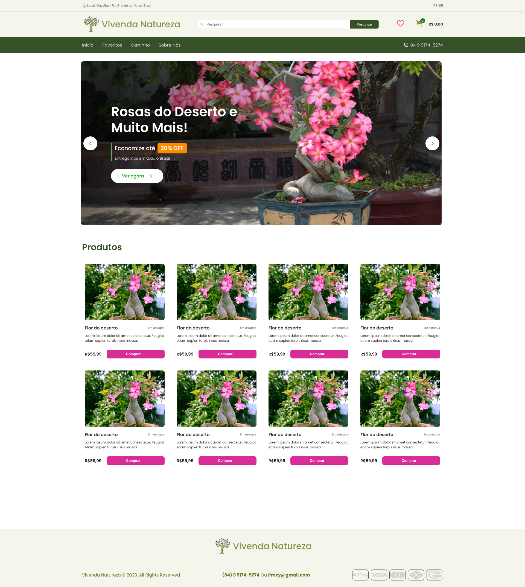

# Documentação do Portfólio

Este documento descreve o portfólio criado por mim, Evilis. O portfólio inclui detalhes sobre os projetos desenvolvidos, tecnologias utilizadas e links relevantes para acesso aos recursos relacionados.

## 1. Visão Geral

O portfólio foi desenvolvido com o objetivo de destacar as minhas habilidades, experiências e projetos. Ele oferece uma visão abrangente dos projetos concluídos e das tecnologias empregadas.

## 2. Projetos

### Projeto 1: E-commerce Vivenda Natureza

O Vivenda Natureza é um projeto de e-commerce para uma floricultura com sede em Macaíba-
RN. Nosso objetivo principal é estabelecer uma presença sólida na internet, permitindo que a floricultura
expanda seu alcance para todo o território nacional.

[Figma](phttps://www.figma.com/file/ATgY5Li7e8rMsoh2MvIgSu/Vivenda-Natureza?type=design&node-id=0%3A1&mode=design&t=iv8cjd8bMrSXu0wJ-1)

Tecnologias Utilizadas:

<code></code>
<code></code>
<code></code>
<code></code>
<code></code>
<code></code>
<code></code>

O projeto consistiu no desenvolvimento de um e-commerce em colaboração com um colega experiente em front-end, utilizando tecnologias modernas para garantir desempenho e segurança. A principal ênfase foi dada à criação de uma experiência de compra intuitiva e agradável para os usuários, visando aumentar as vendas online e promover a satisfação do cliente.

#### Desafios:

Arquitetura Robusta e Escalável: Um dos principais desafios foi projetar uma arquitetura que pudesse lidar com o aumento do tráfego e das transações conforme o e-commerce crescesse. A utilização do Next.js e Typescript proporcionou uma base sólida para a construção de um sistema escalável, permitindo que o site se adaptasse às demandas do mercado de forma eficiente.

Integração do Sistema de Pagamento Stripe: Integrar o sistema de pagamento Stripe foi essencial para garantir uma experiência de compra segura e eficiente aos clientes. Foi necessário compreender e implementar as APIs do Stripe, garantindo uma integração perfeita entre o e-commerce e o processador de pagamentos.

#### Soluções Implementadas:

Desenvolvimento Front-end Responsivo: Foi priorizada a criação de um design responsivo e amigável para o usuário, garantindo uma experiência consistente em diferentes dispositivos e tamanhos de tela. A colaboração estreita com a equipe de front-end permitiu a implementação de layouts flexíveis e elementos visuais atrativos.

Práticas Recomendadas de SEO: Para melhorar a visibilidade e o posicionamento nos motores de busca, foram implementadas práticas recomendadas de SEO. Isso incluiu a otimização de meta tags, a criação de URLs amigáveis e a produção de conteúdo relevante para atrair tráfego orgânico.

Manutenção e Otimização do Desempenho: A manutenção contínua e a otimização do desempenho do site foram fundamentais para garantir uma experiência de compra fluida. Foram realizados testes de compatibilidade em diferentes navegadores e dispositivos, além da identificação e correção de possíveis gargalos de desempenho.

## 3. Tecnologias Utilizadas

Lista das principais tecnologias utilizadas no desenvolvimento dos projetos:

<code></code>
<code></code>
<code></code>
<code></code>
<code></code>
<code></code>
<code></code>
<code></code>
<code></code>
<code></code>
<code></code>
<code></code>
<code></code>
<code></code>
<code></code>

## 4. Contato

Para entrar em contato comigo, utilize as seguintes informações:

Nome: Evilis Glenio
E-mail: [Seu endereço de e-mail]
LinkedIn: [Seu perfil do LinkedIn]
GitHub: [Seu perfil do GitHub]
Outros (se aplicável): [Outras formas de contato] 5. Considerações Finais
Este documento serve como uma referência para entender os projetos e tecnologias presentes no portfólio do desenvolvedor frontend [Seu Nome]. Para mais informações ou para discutir oportunidades de colaboração, sinta-se à vontade para entrar em contato utilizando os detalhes fornecidos acima.
